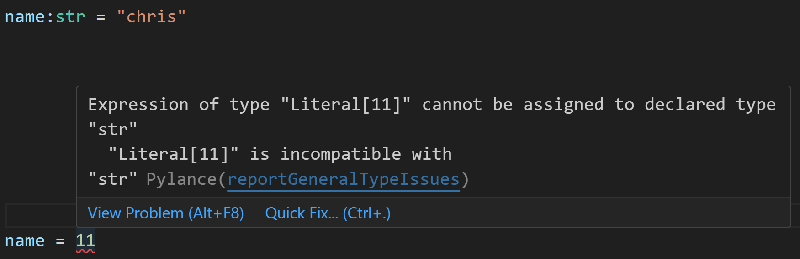

# Data types and variables

A data type in general is a classification of the data. By assigning data as having different types we're able to gain clarity on what we're doing with our code but also helps work with different types of data.

## Introduction

In this chapter we will:

- Understand why types exist.
- Inspect types using `type()` function.
- Leverage variables to create named references to our data.
- Explain the difference between primitive and complex data types.
- Use conversion functions to manage dealing with data of different types.

## Narrative:  Time for a space walk

**Tabitha**: Ok, this REPL thing seems very limited, nothing seems to be responding.

_After checking the major systems on the ship, she finally managed to have a hypothesis, "I need a better visual of what's going on here". The ship's computer wasn't telling her anything, no schematics nothing. "Sigh, nothing to do but a space walk I guess, ah well could be fun". She walked with determined steps to the airlock, found a suit and started to gear up ready for her little promenade._

<div>
  
</div>

## Why are there types?

**Ship**: "Tabitha, where did she go? I can't see her on the cameras"

**Tabitha**: Ok, got a better understanding of things, this will take some time to repair. Let's see how much I can do with Python before I have to resort electronics and welding"

**Ship**: "Tabitha, there you are, we've got more to learn, let me tell you about types"

Types are a way to classify data. By classifying data, we can work with it in a more meaningful way. What does it mean to "work with data" then? What we're saying is if we have data of type `int` we can do math with it, if we have data of type `str` we can present it as text and so on.

Consider the following example of data:

```python
name = "Tabitha"
career_length = 3
```

In the preceding code, you see example of a string type "Tabitha" and 23 which is an integer. Here, we have two different types of data, a string and an integer. It's clear that the two pieces of data are different, text and a number.

**Tabitha**: "Ok, I get it, so types are a way to classify data, but why is that important?"

**Ship**: "Good question, it's important because it helps you work with data in a meaningful way. If you have a number, you can do math with it, if you have text you can present it, if you have a boolean you can make decisions based on it. Types are a way to express intention, what you want to do with your data."

### Presenting data

**Ship**: "Next, let me show you the different ways you can present data in Python"

If you use `print()` function you can print the data to the terminal, like so:

```python
print(name, career_length) # prints Tabitha 3
```

But if you wanted to add some context to above output like printing "Tabitha has worked in the space fleet for 3 years" how would you do that? You could type:

```python
print("Tabitha has worked in the space fleet for ", career_length, " years")
```

or, you could construct a string and then print it like so:

```python
statement = "my name is " + name + " and i have worked for the space fleet for " + str(years_in_it) + " years"  
print(statement)
```

In the preceding code, you see how we leverage `str()` function to convert the integer to a string before we can concatenate it with other strings.

The point of all is, is that a type expresses intention, what you want to do with your data but you need to be prepared to work with conversion functions like `str()` if you want to mix types, unless you have a function like `print()` that can handle different types of data.

**Tabitha**: "Ok, I get it, I can mix variables of different types and construct longer sentences"

## Using `type()` to find out the data type

**Ship**: "Let me show you how you can inspect the type of data in Python"

Ok, so we understand that data types helps us classify data but what is it in Python? To find that out, we can use the `type()` function like so:

```python
type(11) # prints <class 'int'>
type("Tabitha") # <class 'str'>
```

**Tabitha**: "Ok, so `type()` function tells us what type of data we're dealing with, but what does `<class 'int'>` mean?"

**Ship**: "Good question, `<class 'int'>` is the type of the data, in this case an integer. The `int` is short for integer, a whole number. The same goes for `<class 'str'>` which is short for string, a collection of characters."

What happened here and is this output telling us? Data like 11 and "Tabitha" are objects of type `int` and `str`. 

**Tabitha** "Objects, what are those?"

**Ship**: "Objects are instances of classes, a class is a blueprint for an object. Let's come back to that later, for now just know that `int` and `str` are classes and 11 and "Tabitha" are objects.

> [!NOTE]
> We will visit objects and classes later in the book but this is interesting info for later learning.  

## Using variables

**Ship**: To work with different types we want to store them in a named reference so our code becomes easier to read. Consider the following example:

```python
print(3.14)
print(3.14 * 5 * 5)
```

What does the preceding code mean? That's hard to know when looking at it. You could guess that 3.14 is PI a constant that's used in geometry to calculate areas. 

**Tabitha**: "Oh, I like PI :)"

**Ship**: "..."

### Using variables to add clarity

**Ship**: Using variables, and good variable naming we can add clarity to above code by typing like so:

```python
PI = 3.14
radius = 5
print(PI)
area_of_circle = PI * radius * radius
print(area_of_circle)
```

Suddenly our code becomes readable. We also removed repetition as we no longer needed to type 3.14 multiple times and 5 multiple times.

**Tabitha**: "I get, so every time I want to work the value 3.14 then I can just use the variable `PI?`"

**Ship**: "Exactly, and you can use the variable `radius` to represent the radius of a circle for example"

## Primitive vs complex data types

**Ship**: "Let me tell you about primitive and complex data types"

The primitive data types in Python are the following ones:

- `int`, a type representing whole numbers for example 11, or 114. 
- `float`, representing floating point like 3.14. 
- `str`, representing text like "hello" for example. 
- `bool`, is used to represent things are `True` or `False`.

These data types are called "primitive" as they don't consist of other data types. Complex data types on the other hand is the reverse, it consist of primitive data types. An example of a complex data type is list or dictionary which we will cover in future chapters.

**Tabitha**: "So we covered `int` and `str` so far, what about `float` and `bool`?"

**Ship**: "Good question, let me show you shortly"

## integer, to store whole numbers

**Ship**: First, let's talk about integers.

Integers are whole numbers. To create an integer, we create a variable and assign it a piece of data of type integer, a whole number:

```python
radius = 5
print(radius) # 5
type(radius) # <class 'int'>
```

**Tabitha**: "Radius, geometry, I like geometry, you kind of need to if you're going to be in space. PI * R^2, is the area of a circle, right?"

Integers are great when all you deal with are whole numbers. But what about if you're dealing with decimals?

## float, for representing decimals 

**Ship**: If you have numbers that have decimals, you need a `float` type. Consider this example where we are calculating the oxygen level in a spaceship, it's important to get that right so you know how long you can stay in space if you're out on a space walk for example.

```python
oxygen_level = 100.0  # percentage of oxygen in the ship

# oxygen usage during a spacewalk
oxygen_level -= 5.25

# oxygen replenishment by life support systems
oxygen_level += 0.30

print(oxygen_level)  # 95.05
print(type(oxygen_level))  # <class 'float'>
```

Note how all the variables have a decimal point, that's because they are of type `float`.

**Tabitha**: "I'll definitely use that for my next space walk"

## str, to represent text

**Ship**: We've already seen some examples of `str` type, but let's go through it again.

In Python, you can use `str` to represent text, also known as a string.

Another interesting, and very fundamental data type, is `string`. It's used to represent text, for example "hello" or "chris". To create a variable of type string, you create a variable and assign it with data of type string like so:

```python
name = "Tabitha"
type(name) # <class 'str'>
```

**Tabitha**: "Let's make that space captain Tabitha"

**Ship**: "Well, you're an ensign and the captain is in cryo"

**Tabitha**: "I'm the only one awake so that makes me the captain, right?"

**Ship**: "... moving on" 

## bool, representing True or False

**Ship**: "Bool is quite interesting, it's used to represent whether something is `True` or `False`"

The last primitive data type we will describe is boolean. You use this data type to represent whether something is `True` or `False`. It's usually used in conjunction with `If` and `Else` to represent whether an action should be carried out or not. See below example:

```python
oxygen_level = 0  
can_exit_airlock = oxygen_level > 0  # assigned an expression that evaluates to True or False  

should_display_status = True  # example of assigning a True or False value  

if oxygen_level > 0:  
  print("Oxygen levels are good for spacewalk!")  
else:  
  print("Warning: Oxygen levels too low for spacewalk!")  

if should_display_status:  
  print("Displaying oxygen status on the ship's console")  
```

**Ship**: "The code above does the following:"

- It checks if the oxygen level is above 0, if it is, it prints "Oxygen levels are good for spacewalk!" otherwise it prints "Warning: Oxygen levels too low for spacewalk!"
- It also checks if the variable `should_display_status` is `True`, if it is, it prints "Displaying oxygen status on the ship's console". This variable can be used to control whether the status should be displayed or not on your console.

**Tabitha**: "Cool, so this could be nice to have in an oxygen status monitor for my suit"

### Assigning boolean values

**Ship**: Let's focus on two different way of assigning boolean values from above example:

- assign the value directly, here we assign either `True` or `False` directly to the variable.

  ```python
  should_display_status = True # example of assigning a True or False value
  ```

- assign an expression. In this case, the expression evaluates to `True` or `False`:

  ```python
  oxygen_level = 0  
  can_exit_airlock = oxygen_level > 0  # assigned an expression that evaluates to True or False
  ```

  Here `can_exit_airlock` will be `False` as the oxygen level is 0.   

**Tabitha**: "I see, so I can assign `True` or `False` directly or I can assign an expression that evaluates to `True` or `False`"

## More on data types

**Ship**: When you create a variable and assign it a value, a type is inferred. In below code example the variable `name` gets the type string:

```python
name = "Tabitha"
``````

However, this can be changed, by adding a value to add with a different type, like so:

```python
name = 3.14
``````

**Tabitha**: "That doesn't make sense, `name` has value 3.14 now, that seems like the variable name doesn't match the value"

**Ship**: "Indeed, but as you can see, it's possible to change the type of a variable in Python. This is called dynamic typing. 

Python lets you change type on the variable as you can see in preceding code. I recommend that you don't do this unless you have good reason.

In fact, Python let's you add types on a voluntary basis like so:

```python
name: str = "Tabitha"
```

Note how the `name` is assigned type `str` in the preceding code. This is called type hinting and is a way to make your code more readable and maintainable.

You can still do the change above and the code will run but your IDE, your coding environment tooling, will tell you something is wrong like so:



## Conversions

**Ship**: You want to work with different types of data, to present it, do calculations with it and so on. Let's say for example you read data from a terminal or a file and data that is a number is actually stored as a string:

```python
# reading data from terminal as string and stored in `oxygen_level`
oxygen_level = "114"  # oxygen level reported by the ship's sensors as a string
oxygen_replenishment = 100  # oxygen replenishment rate in liters per minute

# how to add oxygen_level + oxygen_replenishment?
``````

in above example, `oxygen_level` is of type string and `oxygen_replenishment` is of type integer. Yet we want to add the two together, how can we do that?

**Tabitha**: "Just add them?"

**Ship**: "Actually, you can't add a string and an integer together, you need to convert the string to an integer first. You can do that using the `int()` function like so:

```python
oxygen_level = "114"  # oxygen level reported by the ship's sensors as a string
oxygen_replenishment = 100  # oxygen replenishment rate in liters per minute

# Convert the oxygen level from string to integer
int_oxygen_level = int(oxygen_level)

# Calculate the total oxygen level after replenishment
total_oxygen_level = int_oxygen_level + oxygen_replenishment

# Print the result
print(f"Current oxygen level: {int_oxygen_level}%")
print(f"Oxygen replenishment rate: {oxygen_replenishment} liters per minute")
print(f"Total oxygen level after replenishment: {total_oxygen_level}%")
```

Note how this operation `int_oxygen_level = int(oxygen_level)` converts our string data into an integer.

Note how we use `f-string` to print the result, this is a way to format strings in Python. The idea is that you use `f"some string {variable}"`, this way you can insert variables into the string and the formatting takes care of the rest converting the variable to a string and concatenating it with the rest of the string.

**Tabitha**: "That looks convenient for sure"

### Additional conversion functions

**Ship**: There's conversion functions for most types you can imagine like `float()`, `int()`, `double()`.

Let's look at an example:

```python
parsecs = 3.14  # float, representing distance in parsecs
int_parsecs = int(parsecs)  # convert float to int
print(f"parsecs: {parsecs}")  # print float
print(f"int_parsecs: {int_parsecs}")  # print int
```

> [!NOTE]
> A parsec is a unit of distance used in astronomy, equivalent to about 3.26 light years. It is derived from the term "parallax of one arcsecond," which refers to the apparent shift in position of a star when observed from two different points in Earth's orbit, separated by six months. This measurement is crucial for determining distances to stars and galaxies in the vast expanse of space.

In the preceding code, we convert a float to an integer.

The question at this point is what does `int_parsecs` contain?

The answer is 3, not 3.14, so what happened? When we converted something of type `float` to `int` it looses precision, i.e the decimals.

> [!TIP]
> Be careful when you convert a float to an integer, you might loose precision. In space that can have huge consequences.

### Boolean coercion

**Ship**: Now consider the following code:

```python
oxygen_level = 3.14  # float, representing oxygen level in the ship
bool_oxygen_level = bool(oxygen_level)  # convert float to boolean
print(f"bool_oxygen_level: {bool_oxygen_level}")  # print boolean value of oxygen level

# Checking boolean coercion for different values
print(f"bool_oxygen_level (0 oxygen): {bool(0)}")  # False, no oxygen
print(f"bool_oxygen_level (-1 oxygen): {bool(-1)}")  # True, negative oxygen level (hypothetical)
```

What do you think the preceding code will print? The answer is `False` and `True`. The reason for this output is that positive, and negative numbers, will be coerced into the value `True` and the value 0 will be converted into `False`.  This might not be super intuitive, but it's good to know.

## Assignment, describe the ship's components

**Tabitha**: I did make some observations before when I went on that space walk, let me see if I can remember what I saw and apply my knowledge on types.

Task: Your task is to describe the ship's components, their names and a suitable data type for each. Here's the list of components given Tabitha's recollection:

- Engine, 3 major engines
- Fuel, 2 fuel tanks
- Fuel capacity, 72.5 % full

Print the scores to the terminal.

Try running the [ship's code](./code/ship.py) and the command "ship". Investigate the "ship" command in the source code to get a hint on how to write your code.

## Solution

[Solution](./solutions/solution.py)
[Ship's code](./ship.py)

## Quiz

**Question:** What is the correct data type for a collection of characters in Python?

1. `int`
2. `float`
3. `str`

[Quiz solution](./solutions/solution-quiz.md)