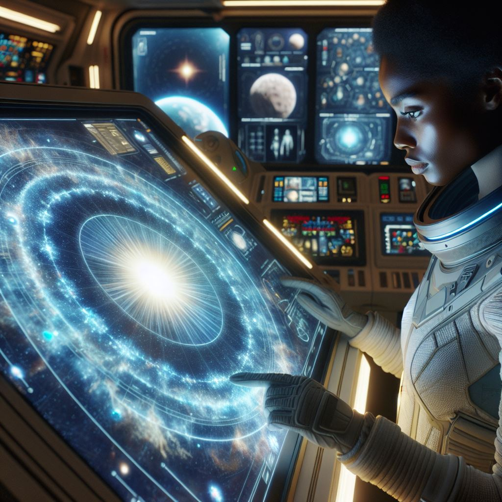
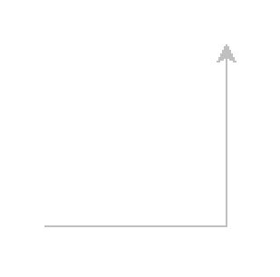
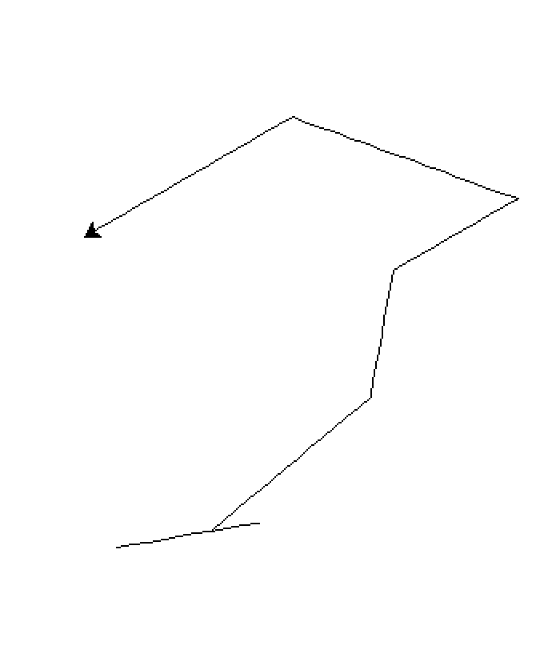

# Turtle Graphics

Turtle graphics is a popular way to introduce programming to kids. It was part of the original Logo programming language developed by Wally Feurzeig, Seymour Papert, and Cynthia Solomon in the 1960s.

It can also be useful in a classroom setting to teach Python programming. The turtle module in Python allows you to create graphics and pictures by using a turtle that can move around the screen.

For production, you would use a more advanced graphics library like Pygame or Pyglet, but for learning purposes, turtle graphics is a great way to get started.

## Introduction

In this chapter, we will:

- Understand what turtle graphics is.
- Learn how to use the turtle module in Python.
- Create simple graphics using turtle graphics.

## Narrative: Star chart

_The program handling the visual output of the star chart can be improved. What's there now works for the ship, but it's not very flexible. It would be nice to have a way to draw other objects on the screen, like planets or asteroids and the course the ship is following_

<div>
    
</div>

## What is turtle graphics and why use it?

**Ship**: Tabitha? There's something we need to do.

**Tabitha**: Yes, what can I do?

**Ship**: We need to improve the program that handles the visual output of the star chart. It's not very flexible, and we need a way to draw other objects on the screen, like planets or asteroids, and the course the ship is following.

**Tabitha**: I can see how that's important. How does it work now?
**Ship**: Well, it's quite limited. We can only draw the ship and the course it's following. Other objects aren't covered.

**Tabitha**: I see. Sounds like an important project. Where do we start?

**Ship**: We need to use the turtle graphics module in Python. It's a simple way to create graphics and pictures by using a turtle that can move around the screen.

**Tabitha**: "Turtle graphics? Fun name, let's do it!"
 
**Ship**: Turtle graphics isn't normally for production use, but I'll make an exception for this case. However, we should be looking for a more advanced graphics libraries. But let's start here.

## How to use turtle graphics

**Tabitha**: So, how do we get started with turtle graphics?

**Ship**: "First, we need to understand the steps involved".

To use Turtle graphics in Python, you need to do the following:

- Import the turtle module.
- Create a turtle object.
- Use the turtle object to draw on the screen by calling methods like `forward()`, `backward()`, `left()`, and `right()`.

Let's see a simple example:

```python
import turtle

# Create a spaceship object
spaceship = turtle.Turtle()

# Set spaceship color
spaceship.color("silver")

# Set spaceship speed
spaceship.speed(1)

# Move the spaceship forward and turn
spaceship.forward(100)
spaceship.left(90)
spaceship.forward(100)

# Keep the window open
turtle.done()
```

Where you to run this example, you would see a red line drawn on the screen, that is 100 pixels long and then turns 90 degrees to the left and draws another 100 pixels. Let's break down the code:

- `import turtle`: This imports the turtle module.
- `spaceship = turtle.Turtle()`: This creates a turtle object named `spaceship`.
- `spaceship.color("silver")`: This sets the color of the spaceship to silver.
- `spaceship.speed(1)`: This sets the speed of the spaceship to 1 (slow).
- `spaceship.forward(100)`: This moves the spaceship forward by 100 pixels.
- `spaceship.left(90)`: This turns the spaceship left by 90 degrees.
- `spaceship.forward(100)`: This moves the spaceship forward by 100 pixels again.
- `turtle.done()`: This keeps the window open until you close it.

You should see something like this:



> [!NOTE]
> Code example available here: [Spaceship code](./code/spaceship.py)

### Control the turtle

**Tabitha**: That looks great! But what if we want to control the spaceship, if we lets say wants to make a simulation where we need to avoid asteroids?

**Ship**: "Good question! We can use the keyboard to control the turtle, i.e spaceship. We can associate key presses with functions that move the turtle. This way, we can control the spaceship using the keyboard."

To capture keyboard events, you can use the `onkey()` method. How it works is that `onkey()` binds a function to a key press event. The general syntax is:

```python
screen = turtle.Screen()

def function():
    pass # do something

screen.onkey(function, "key")
```

**Tabitha**: So, we can use the `onkey()` method to bind a function to a key press event. Can you show me an example?

**Ship**: Sure! Let's create a simple example where we can control the turtle using the keyboard. We will use the `w`, `a`, `s`, and `d` keys to move the turtle up, left, down, and right, respectively.

```python
import turtle

# Create a turtle object
spaceship = turtle.Turtle()
spaceship.speed(1)

def move_forward():
    spaceship.forward(10)

def move_backward():
    spaceship.backward(10)

def turn_left():
    spaceship.left(10)

def turn_right():
    spaceship.right(10)

# Create a screen object
screen = turtle.Screen()

# Bind the keys
screen.listen()
screen.onkey(move_forward, "w")
screen.onkey(move_backward, "s")
screen.onkey(turn_left, "a")
screen.onkey(turn_right, "d")

# Keep the window open
screen.mainloop()
```

The preceding code works as follows:

- `spaceship = turtle.Turtle()`: This creates a turtle object named `spaceship`.
- `spaceship.speed(1)`: This sets the speed of the spaceship to 1 (slow).
- `move_forward()`, `move_backward()`, `turn_left()`, and `turn_right()` are functions that move the spaceship in the respective directions.
- `screen = turtle.Screen()`: This creates a screen object.
- `screen.listen()`: This tells the screen to listen for key presses.
- `screen.onkey(move_forward, "w")`: This binds the `move_forward()` function to the `w` key.
- `screen.onkey(move_backward, "s")`: This binds the `move_backward()` function to the `s` key.
- `screen.onkey(turn_left, "a")`: This binds the `turn_left()` function to the `a` key.
- `screen.onkey(turn_right, "d")`: This binds the `turn_right()` function to the `d` key.
- `screen.mainloop()`: This keeps the window open and listens for key presses.

You should see something like this, as you press the keys, the spaceship moves in the respective direction:



> [!NOTE]
> Code example available here: [Spaceship control code](./code/spaceship-moving.png)

## Use the mouse to draw shapes

**Tabitha**: Very cool. I wonder, imagine I'm building a map, trying to plot the course of the ship, asteroids, and planets. I want to be able to click on the screen and draw a figure at that position. Is that possible?

**Ship**: Yes, it is! You can use the mouse to draw shapes. The turtle module provides a way to bind mouse events to functions. For example, you can use the `onscreenclick()` method to bind a function to a mouse click event. When you click on the screen, the function will be called with the coordinates of the click.

**Tabitha**: "Please show me an example."

**Ship**: "Of course, let's cover the basics first. "

- `penup()`: This lifts the pen so that the turtle doesn't draw a line when moving.
- `goto()`: This moves the turtle to the new position.
- `pendown()`: This puts the pen back down so that the turtle can draw. 

Now you're in a position to draw whatever you want. Here is an example:

```python
import turtle

# Create a turtle object
planet = turtle.Turtle()
planet.speed(1)

def draw_planet(x, y):
    planet.penup()
    planet.goto(x, y)
    planet.pendown()
    planet.color("blue")  # Set the color to blue for the planet
    planet.begin_fill()   # Start filling the shape
    planet.circle(50)     # Draw the planet
    planet.end_fill()     # End filling the shape
   

# Bind the mouse click event
turtle.onscreenclick(draw_planet)

# Keep the window open
turtle.done()
```

Let's break down the code:

- `planet = turtle.Turtle()`: This creates a turtle object named `planet`.
- `planet.speed(1)`: This sets the speed of the planet to 1 (slow).
- `draw_planet(x, y)`: This function is called when the mouse is clicked. It takes the x and y coordinates of the click as arguments.
- `planet.penup()`: This lifts the pen so that the turtle doesn't draw a line when moving.
- `planet.goto(x, y)`: This moves the turtle to the new position (x, y).
- `planet.pendown()`: This puts the pen back down so that the turtle can draw.
- `planet.color("blue")`: This sets the color of the planet to blue.
- `planet.begin_fill()`: This starts filling the shape.
- `planet.circle(50)`: This draws a circle with a radius of 50 pixels.
- `planet.end_fill()`: This ends filling the shape. 
- `turtle.onscreenclick(draw_planet)`: This binds the `draw_planet()` function to the mouse click event.
- `turtle.done()`: This keeps the window open until you close it.

Now, let's add a feature, let's add an outer ring to the planet. We can do this by drawing a larger circle around the planet. Here's how you can do it:

```python
import turtle

# Create a turtle object
planet = turtle.Turtle()

planet.speed(1)

def draw_planet(x, y):
    planet.penup()
    planet.goto(x, y)
    planet.pendown()
    planet.color("blue")  # Set the color to blue for the planet
    planet.begin_fill()   # Start filling the shape
    planet.circle(50)     # Draw the planet
    planet.end_fill()     # End filling the shape

    # Draw the outer ring
    planet.penup()
    planet.goto(x, y - 10)  # Move to the center of the planet
    planet.pendown()
    planet.color("red")  # Set the color to red for the ring
    planet.circle(60)     # Draw the outer ring
    planet.penup()
    planet.goto(0, 0)     # Move back to the center
    planet.pendown()
    planet.color("black")  # Set the color back to black
# Bind the mouse click event
turtle.onscreenclick(draw_planet)
# Keep the window open
turtle.done()
```

Here's what we did to construct the outer ring:

- `planet.penup()`: This lifts the pen so that the turtle doesn't draw a line when moving.
- `planet.goto(x, y - 10)`: This moves the turtle to the center of the planet. The reason for the `y - 10` is to move the turtle down a bit so that the ring is drawn around the planet.
- `planet.pendown()`: This puts the pen back down so that the turtle can draw.
- `planet.color("red")`: This sets the color of the ring to red.
- `planet.circle(60)`: This draws the outer ring with a radius of 60 pixels. Remember the planet is 50 pixels, so the ring will be larger than the planet.
- `planet.penup()`: This lifts the pen so that the turtle doesn't draw a line when moving.
- `planet.goto(0, 0)`: This moves the turtle back to the center.
- `planet.pendown()`: This puts the pen back down so that the turtle can draw.
- `planet.color("black")`: This sets the color back to black.
- `turtle.onscreenclick(draw_planet)`: This binds the `draw_planet()` function to the mouse click event.
- `turtle.done()`: This keeps the window open until you close it.

**Tabitha**: Oh, I like that, looks like Saturn. Now I wish there was a way to decide things like color of planet, size, with or without ring, etc. Can we do that?

**Ship**: Yes, for sure, let's make this into a proper program next

## Advanced example, let's build star system chart

**Ship**: Let's build a star system chart. We will create a program that allows you to draw planets, and we should be able to specify the color, size, and whether or not to draw a ring around the planet before we click. That means we need a way to ask the user for input before each click.
**Tabitha**: Sounds good. How do we do that?

**Ship**: We can use the `input()` function to ask the user for input. We can ask for the color, size, and whether or not to draw a ring. Then we can use that input to draw the planet.

**Tabitha**: "Sounds like a plan. Let's do it!"

```python
import turtle
import tkinter as tk
from tkinter import simpledialog

# Set the background color to black
turtle.bgcolor("black")

# Create a turtle object
drawer = turtle.Turtle()
drawer.speed(1)

def draw_planet(x, y, color, size, draw_ring):
    drawer.penup()
    drawer.goto(x, y)
    drawer.pendown()
    drawer.color(color)  # Set the color for the planet
    drawer.begin_fill()  # Start filling the shape
    drawer.circle(size)  # Draw the planet
    drawer.end_fill()    # End filling the shape

    if draw_ring:
        # Draw the outer ring
        drawer.penup()
        drawer.goto(x, y - 10)  # Move to the center of the planet
        drawer.pendown()
        drawer.color("red")  # Set the color to red for the ring
        drawer.circle(size + 10)  # Draw the outer ring
        drawer.penup()
        drawer.goto(0, 0)     # Move back to the center
        drawer.pendown()
        drawer.color("black")  # Set the color back to black

def on_click(x, y):
    root = tk.Tk()
    root.withdraw()  # Hide the root window

    input_data = simpledialog.askstring(
        "Input", 
        "Enter the color, size, and ring (yes/no) separated by commas (e.g., red,50,yes):"
    )

    if input_data:
        try:
            color, size, draw_ring = [item.strip() for item in input_data.split(",")]
            size = int(size)
            draw_ring = draw_ring.lower() == "yes"
            draw_planet(x, y, color, size, draw_ring)
        except ValueError:
            print("Invalid input format. Please try again.")

# Bind the mouse click event
turtle.onscreenclick(on_click)
# Keep the window open
turtle.done()

```

Let's break down the code:

**Creating a dialog box for user input**:

- We added a library called `tkinter` to create a simple dialog box for user input. Here's how the dialog works:
  - `root = tk.Tk()`: This creates a root window for the dialog.
  - `root.withdraw()`: This hides the root window so that only the dialog is shown.
  - `simpledialog.askstring(...)`: This shows a dialog box asking for input. The user can enter the color, size, and whether or not to draw a ring, separated by commas.

**Handling user input**:

- `input_data = simpledialog.askstring(...)`: This gets the input from the user.
- `if input_data:`: This checks if the user entered any input.
- `color, size, draw_ring = [item.strip() for item in input_data.split(",")]`: This splits the input string into color, size, and draw_ring. It also removes any leading or trailing whitespace.
- `size = int(size)`: This converts the size to an integer.
- `draw_ring = draw_ring.lower() == "yes"`: This checks if the user wants to draw a ring. If the user enters "yes", it sets `draw_ring` to `True`, otherwise it sets it to `False`.
- `draw_planet(x, y, color, size, draw_ring)`: This calls the `draw_planet()` function with the user input.

**Tabitha**: Wow, this is really coming together. What about the asteroids?

**Ship**: I'm going to leave that to you.

## More advanced UI

**Ship**: So far, we have a simple dialog box for user input. The input has been comma separated, and we have to remember the order of the input. We can improve this by creating a more advanced UI using `tkinter`.

The idea is to introduce the following UI elements:

- Dropdown menu for planet or asteroid.
- Text input for color.
- Slider for size.
- Checkbox for ring or not.

### Root

Before we start, we need to create a root window for our UI. Here's how you can do it:

```python
root = tk.Tk()
```

You need to pass the root window to the `OptionMenu`, `Scale`, and `Checkbutton` widgets. You can also set the title of the window using `root.title("Star System Chart")`.

Once you're done with the UI, you can call `root.mainloop()` to start the event loop and display the window.

To destroy the window, you can call `root.destroy()`.

So your code should look like this:

```python
import tkinter as tk
root = tk.Tk()

# define components in root

root.title("Star System Chart")
# Start the event loop
root.mainloop()
# Destroy the window
root.destroy()
```

### Drop down menu

**Tabitha**: I like the idea of a dropdown menu. It would be nice to have a list of options to choose from. It also means we can add more options and I can't mess it up by typing the wrong thing.

**Ship**: Yes, exactly. We can use the `OptionMenu` widget in `tkinter` to create a dropdown menu. Here's how you can do it:

```python
tk.Label(root, text="Select Object Type:").pack()
object_type_var = tk.StringVar(value="Planet")
tk.OptionMenu(root, object_type_var, "Planet", "Asteroid").pack()
```

In the preceding code we create:

- A label for the dropdown menu with text "Select Object Type:".
- A `StringVar` variable to hold the selected value. We set the default value to "Planet".
- An `OptionMenu` widget that creates the dropdown menu. We pass the `StringVar` variable and the options "Planet" and "Asteroid".
- Lastly, we pack the dropdown menu to the window, to make sure it is displayed.  

To read the selected value, you can use `object_type_var.get()`. This will return the selected value from the dropdown menu.

### Slider

For the slider, we can use the `Scale` widget in `tkinter`. Here's how you can do it:

```python
tk.Label(root, text="Select Size:").pack()
size_slider = tk.Scale(root, from_=0, to=100, orient=tk.HORIZONTAL)
size_slider.pack() 
```

In the preceding code we create:

- A label for the slider with text "Select Size:".
- A `Scale` widget that creates the slider. We set the range from 0 to 100 and set the orientation to horizontal.
- Lastly, we pack the slider to the window, to make sure it is displayed.

To read the selected value, you can use `size_slider.get()`. This will return the selected value from the slider.

### Checkbox

For the checkbox, we can use the `Checkbutton` widget in `tkinter`. Here's how you can do it:

```python
def update(res):
      before = res.get() 
      print(f"Present value {before}")
      res.set(not before)
      print(f"Updated value {res.get()}") 

    ring_var = tk.BooleanVar(value=False)
    ch = tk.Checkbutton(root, text="Has Ring (for Planet)", variable=ring_var, command= lambda: update(ring_var))
    ch.pack()  # Ensure the Checkbutton is packed to display
```

In the preceding code we create:

- A `BooleanVar` variable to hold the checkbox value. We set the default value to `False`.
- A `Checkbutton` widget that creates the checkbox. We pass the `BooleanVar` variable and set the text to "Has Ring (for Planet)".
- Assign a command to the checkbox that will be called when the checkbox is clicked. The command is a lambda function that calls the `update()` function with the `BooleanVar` variable as an argument.
- Lastly, we pack the checkbox to the window, to make sure it is displayed.

To read the selected value, you can use `ring_var.get()`. This will return `True` if the checkbox is checked and `False` if it is not.

### Text input

For the text input, we can use the `Entry` widget in `tkinter`. Here's how you can do it:

```python
tk.Label(root, text="Type Color:").pack()
color_var = tk.StringVar(value="red")
color_picker = tk.Entry(root, textvariable=color_var)
color_picker.pack()
```

In the preceding code we create:

- A label for the text input with text "Type Color:".
- A `StringVar` variable to hold the text input value. We set the default value to "red".
- An `Entry` widget that creates the text input. We pass the `StringVar` variable to the `textvariable` parameter.
- Lastly, we pack the text input to the window, to make sure it is displayed.

To read the text input value, you can use `color_var.get()`. This will return the text entered in the input field.

## Assignment

**Ship**: Now that we have the UI components, let's put it all together.

> Task: Your task is to create a program that allows the user to select the object type (planet or asteroid), enter the color, select the size using a slider, and check if it has a ring or not. When the user clicks on the screen, the program should draw the selected object at the clicked position.

## Solution

[Solution](./solution/solution.py)

## Quiz

Question: Which of the following methods is used to move the turtle forward?

1. `turtle.move()`
2. `turtle.forward()`
3. `turtle.step()`

Question: Which method is used to turn the turtle to the left by a specified angle?

1. `turtle.rotate_left()`
2. `turtle.left()`
3. `turtle.turn()`

[Solution quiz](./solution/solution-quiz.md)

## Summary

In this chapter, we learned about turtle graphics and how to use the turtle module in Python. We created a simple program to draw planets and asteroids on the screen. We also learned how to use keyboard events to control the turtle and how to use mouse events to draw shapes. Finally, we created a more advanced UI using `tkinter` to allow the user to select the object type, enter the color, select the size, and check if it has a ring or not.

All this while helping Tabitha and the ship to improve the program that handles the visual output of the star chart.