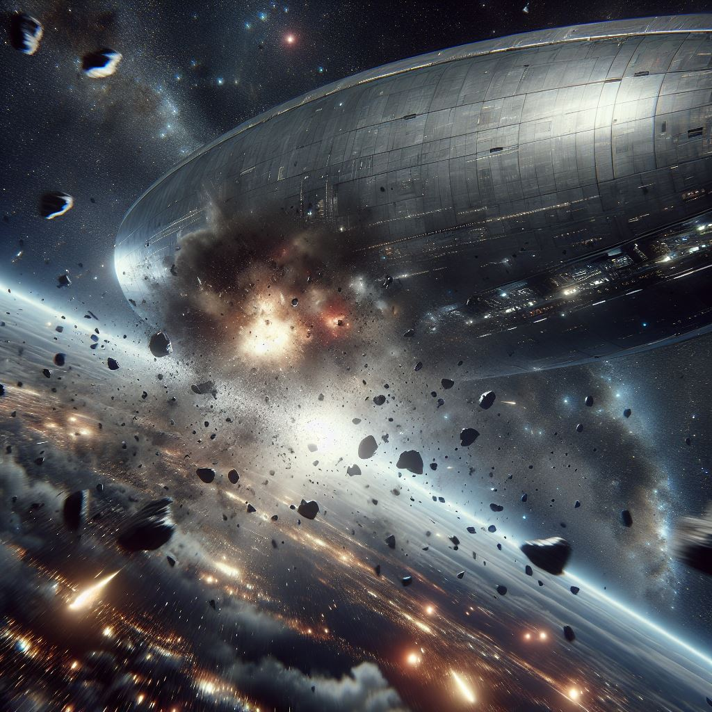
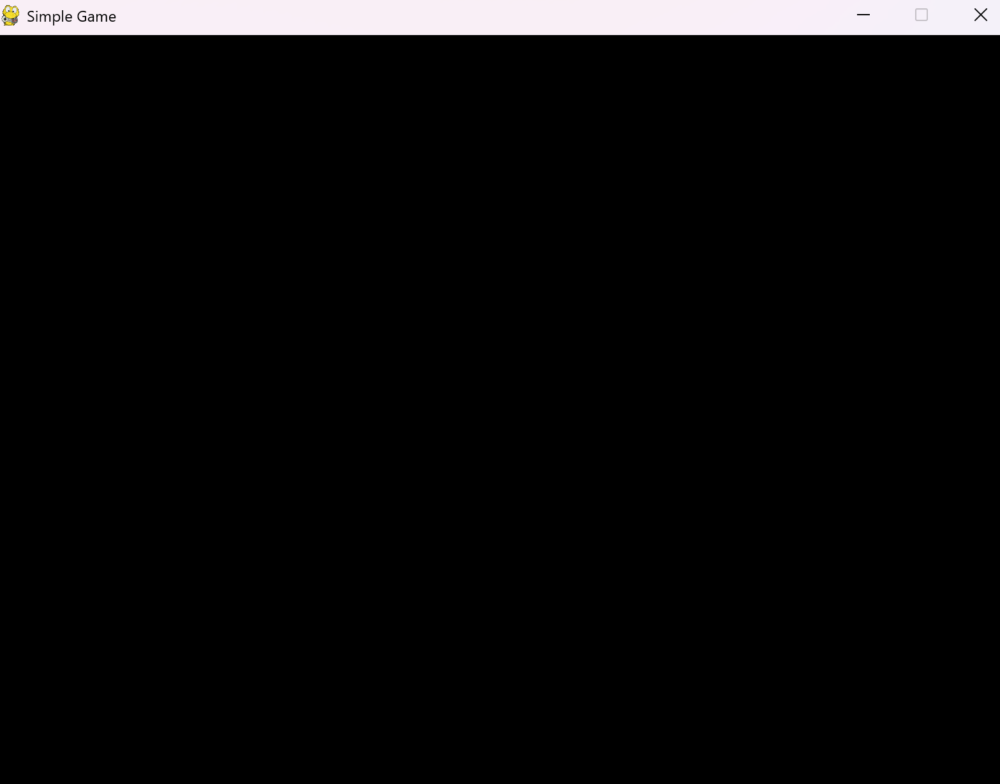
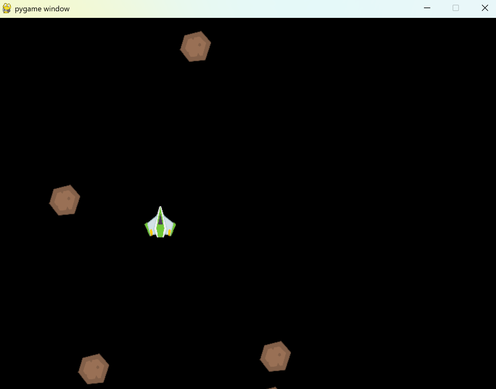

# Game programming

We've seen so far how Turtle graphics can be used to create simple games or simulations. While built-in the Python standard library, Turtle graphics is not the most efficient way to create games or more complex simulations. In this lesson, we'll look at a more powerful library called Pygame. Pygame is a set of Python modules designed for writing video games. It provides functionalities like creating windows, drawing shapes, handling user input, and playing sounds.

## Introduction

In this chapter, we will:

- Understand what Pygame is and how it works.
- Learn to build both a simple game and a more complex game using Pygame.
- Leverage graphics and sound to enhance the gaming experience.
- Understand the game loop and how it works in Pygame.

## Narrative: Almost, but not quite - Asteroids!!!

_You're on course for Proxima Centauri, everything is going good. Tabitha is considering to go back into cryo sleep when there's a sudden jolt. The ship is hit by a small asteroid and there's more where that came from. You have to save the ship._

<div>
    
</div>

## The game loop

**Ship**: "Tabitha, wake up, Tabitha, we have a problem. We are being hit by asteroids. I need you to help me out here."
**Tabitha**: "What, what, asteroids, let me clear my head.  Ok, Asteroids"

*Chunk*, ship was just hit by a small asteroid.

**Ship**: "It's going to get worse, I need you to get out there, use one of the fighters and destroy the asteroids before they hit us. My scanners are telling me we're about to be hit by even bigger asteroids in just a few days"

**Tabitha**: "Can't you just steer away from them?"

**Ship**: "Normally, yes, but it seems something is wrong with navigation sensors"

**Tabitha**: "Ok, here's one problem though, I don't know how to fly a fighter. I can barely fly this ship."

**Ship**: "Don't worry, I can help you with that. We just need to train you in the simulator. I can simulate the fighter facing off against the asteroids. You just need to learn how to control the fighter and shoot the asteroids before they hit us."

**Tabitha**: "Ok, I'm heading over to the simulator now. I hope this is going to be easy."

**Tabitha**: "Ok, I'm in the simulator. What do I do now?"

**Ship**: "Let me start it up....., this can't be right, where's simulator program for asteroids? What's actually working on this ship *sigh*. Ok, so I need you to help me build the simulation software"

**Tabitha**: "What? Ok, ok, let's do it. I can do this. Come on Tabitha, you can do this."

**Ship**: "We might as well start, let's talk about the game loop. The game loop is the core of any game. It continuously checks for events (like user input), updates the game state, and renders the graphics. In Pygame, the game loop typically looks like this:

```python
import pygame

# Initialize Pygame
pygame.init()

# Set up the display
screen = pygame.display.set_mode((800, 600))

# how do you set title on a pygame window?
pygame.display.set_caption("Simple Game")

# screen.title("Simple Game")

# Main game loop
running = True
while running:
    # Handle events
    for event in pygame.event.get():
        if event.type == pygame.QUIT:
            running = False

    # Update game state
    # TODO: Update game objects here

    # Draw everything
    screen.fill((0, 0, 0))  # Clear the screen with black
    # Draw your game objects here

    pygame.display.flip()  # Update the display
```

In the preceding code we:

- Initialize Pygame and create a window with the code `pygame.display.set_mode((800, 600))`. This creates a window of size 800x600 pixels.
- Set up a game loop that runs until the user closes the window. It's a while loop that checks for events, updates the game state, and draws everything on the screen. Here's the code:
  - `pygame.event.get()` retrieves all the events from the event queue.
  - The loop checks if the event type is `pygame.QUIT`, which indicates that the user has closed the window. If so, it sets `running` to `False`, which will exit the loop.
- Update the game state (this is where you would update the positions of your game objects). vWe don't have any game objects yet, so this part is empty.
- Draw everything on the screen. The `screen.fill((0, 0, 0))` line clears the screen with a black color, and `pygame.display.flip()` updates the display.

### Setting up Pygame

**Ship**: "Using pygame is easy, but you need to install it first. You can do this using pip, the Python package manager. Just run the following command in your terminal or command prompt:"

```sh
pip install pygame
```

However, it's recommended to use a virtual environment to manage your dependencies. 

**Tabitha**: "What is a virtual environment?"

**Ship**: "A virtual environment is a self-contained directory that contains a Python installation for a particular version of Python, plus several additional packages. It allows you to manage dependencies for different projects separately. You want to avoid installing packages globally, as this can lead to version conflicts between projects. 

**Tabitha**: "Got it, so how do I set up a virtual environment?"

**Ship**: "You can create a virtual environment using the following command in your terminal or command prompt. Make sure you have Python 3 installed."

```sh
python3 -m venv venv
```

**Tabitha**: "That's it?"

**Ship**: "Yes, but you need to activate it. On Windows, you can activate it with the following command:"

```sh
venv\Scripts\activate
```

**Tabitha**: "And on MacOS or Linux?"

**Ship**: "On MacOS or Linux, you can activate it with this command:"

```sh
source venv/bin/activate
```

**Tabitha**: "And then I can install Pygame?"

**Ship**: "Exactly! After activating the virtual environment, you can install Pygame using pip."

```sh
pip install pygame
```

**Ship**: "Try running the code [here](./code/app.py) to see if it works, don't forget to create the virtual environment first, activate it and install pygame. You can run the code using the command:"

```sh
python app.py
```

You should see a window pop up with the title "Simple Game". If you close the window, the program should exit.

<div>
    
</div>

**Tabitha**: "Ok, I see the window, but it doesn't do anything."

**Ship**: "That's right, it's just a blank window. We need to add some game objects and logic to make it interesting. Let's try building it out step by step. First, let's add a player ship that can move around the screen. We'll use the arrow keys to control the ship's movement."

## Drawing to the screen

**Ship**: For the ship, we'll use a simple rectangle. Here's how you can draw it:

```python
player_ship = pygame.Rect(400, 300, 50, 50)  # x, y, width, height
```

At this point, you have a rectangle representing the player ship. Next, you need to include it as part of the game loop. Here's how you can do that:

```python
while running:
    # code omitted for brevity
    pygame.draw.rect(screen, WHITE, player_ship)  # Draw the player ship
    pygame.display.flip()  # Update the display
```

Let's now put it all together. Here's the complete code to draw the player ship on the screen:

```python
import pygame

# Initialize Pygame
pygame.init()
# Set up the display
screen = pygame.display.set_mode((800, 600))
# Set up the clock
clock = pygame.time.Clock()
# Set up colors
WHITE = (255, 255, 255)
BLACK = (0, 0, 0)
# Set up the player ship
player_ship = pygame.Rect(400, 300, 50, 50)  # x, y, width, height
# Main game loop
running = True
while running:
    # Handle events
    for event in pygame.event.get():
        if event.type == pygame.QUIT:
            running = False

    # Update game state

    # Draw everything
    screen.fill(BLACK)  # Clear the screen with black
    pygame.draw.rect(screen, WHITE, player_ship)  # Draw the player ship

    pygame.display.flip()  # Update the display
    clock.tick(60)  # Limit the frame rate to 60 FPS
```

In the preceding code:

- It draws a white rectangle representing the player ship at the position (400, 300) with a width and height of 50 pixels. See this code `pygame.draw.rect(screen, WHITE, player_ship)`. The position is defined by the rectangle object `player_ship`. The `player_ship` variable is defined like so `player_ship = pygame.Rect(400, 300, 50, 50)`. This means it will be drawn at the coordinates (400, 300) on the screen and have a width and height of 50 pixels.

**Tabitha**: "Ok, I see the ship, but I can't move it."

**Ship**: "That's right, we need to add some logic to move the ship. We'll use the arrow keys to control the ship's movement."

## Moving the ship

**Ship**: "To move the ship, we need to check for key presses and update the position of the ship accordingly. Here's how you can do that:"

```python

while running:
    # Handle events
    for event in pygame.event.get():
        if event.type == pygame.QUIT:
            running = False


        if event.type == pygame.KEYDOWN:
            if event.key == pygame.K_LEFT:
                player_ship.x -= 5
            if event.key == pygame.K_RIGHT:
                player_ship.x += 5
            if event.key == pygame.K_UP:
                player_ship.y -= 5
            if event.key == pygame.K_DOWN:
            player_ship.y += 5
```

In the preceding code we:

- Check if there's events we need to handle like `pygame.QUIT`, if someone closes the window. 
- We additionally check if there's a key press event `pygame.KEYDOWN`. 
- Then we need to figure out if it's one of the arrow keys. If it is, we update the position of the ship by changing the x and y coordinates of the `player_ship` rectangle. The ship moves 5 pixels in the direction of the arrow key pressed.

Let's incorporate this into the main game loop. Here's the complete code:

```python
import pygame

# Initialize Pygame
pygame.init()

# Set up the display
screen = pygame.display.set_mode((800, 600))
# Set up the clock
clock = pygame.time.Clock()
# Set up colors
WHITE = (255, 255, 255)
BLACK = (0, 0, 0)

# Set up the player ship
player_ship = pygame.Rect(400, 300, 50, 50)  # x, y, width, height

# Main game loop
running = True
while running:
    # Handle events
    for event in pygame.event.get():
        if event.type == pygame.QUIT:
            running = False

        if event.type == pygame.KEYDOWN:
            if event.key == pygame.K_LEFT:
                player_ship.x -= 5
            if event.key == pygame.K_RIGHT:
                player_ship.x += 5
            if event.key == pygame.K_UP:
                player_ship.y -= 5
            if event.key == pygame.K_DOWN:
                player_ship.y += 5

    # Update game state

    # Draw everything
    screen.fill(BLACK)  # Clear the screen with black
    pygame.draw.rect(screen, WHITE, player_ship)  # Draw the player ship

    pygame.display.flip()  # Update the display
    clock.tick(60)  # Limit the frame rate to 60 FPS
```

> [!NOTE]
> If you want to try out this code yourself, you can find it in the `code` directory as [app-ship-moving.py](./code/app-ship-moving.py). You can run it using the command:

```sh
python app-ship-moving.py
```

> Don't forget to create the virtual environment first, activate it and install pygame.

**Tabitha**: "Ok, I can move the ship now. But it doesn't look like a ship, and where's the meteors and asteroids I was supposed to destroy?"

**Ship**: "Right, let's start with the meteors and asteroids and see if you can avoid those".

## Adding meteors and collisions

**Ship**: "To add meteors, we can create a list of meteor objects. Each meteor will be represented by a rectangle, just like the player ship. We'll randomly generate the position and size of each meteor. We also want to make sure the meteors move across the screen. Here's how you can do that:"

```python
# create the metors
meteors = []

for _ in range(5):  # Create 5 meteors
    meteor_x = random.randint(0, 800)
    meteor_y = random.randint(0, 600)
    meteor_width = random.randint(20, 50)
    meteor_height = random.randint(20, 50)
    meteor = pygame.Rect(meteor_x, meteor_y, meteor_width, meteor_height)
    meteors.append(meteor)

# Update game state
while running:
    # code omitted for brevity
    for meteor in meteors:
        meteor.y += 5  # Move the meteor down the screen
        if meteor.y > 600:  # If the meteor goes off the screen, reset its position
            meteor.y = 0
            meteor.x = random.randint(0, 800)
```

**Ship**: "In the preceding code, we create a list of meteors. Each meteor is represented by a rectangle, and we randomly generate its position and size. The meteors move down the screen at a speed of 5 pixels per frame. If a meteor goes off the screen, we reset its position to the top and give it a new random x-coordinate."

The full code to add meteors and move them down the screen is as follows:

```python
import pygame

import random

# Initialize Pygame
pygame.init()

# Set up the display
screen = pygame.display.set_mode((800, 600))
# Set up the clock
clock = pygame.time.Clock()

# Set up colors
WHITE = (255, 255, 255)
BLACK = (0, 0, 0)
# Set up the player ship
player_ship = pygame.Rect(400, 300, 50, 50)  # x, y, width, height
# Create the meteors
meteors = []
for _ in range(5):  # Create 5 meteors
    meteor_x = random.randint(0, 800)
    meteor_y = random.randint(0, 600)
    meteor_width = random.randint(20, 50)
    meteor_height = random.randint(20, 50)
    meteor = pygame.Rect(meteor_x, meteor_y, meteor_width, meteor_height)
    meteors.append(meteor)

# Main game loop
running = True

while running:
    # Handle events
    for event in pygame.event.get():
        if event.type == pygame.QUIT:
            running = False

        if event.type == pygame.KEYDOWN:
            if event.key == pygame.K_LEFT:
                player_ship.x -= 5
            if event.key == pygame.K_RIGHT:
                player_ship.x += 5
            if event.key == pygame.K_UP:
                player_ship.y -= 5
            if event.key == pygame.K_DOWN:
                player_ship.y += 5

    # Update game state
    for meteor in meteors:
        meteor.y += 5  # Move the meteor down the screen
        if meteor.y > 600:  # If the meteor goes off the screen, reset its position
            meteor.y = 0
            meteor.x = random.randint(0, 800)

    # Draw everything
    screen.fill(BLACK)  # Clear the screen with black
    pygame.draw.rect(screen, WHITE, player_ship)  # Draw the player ship

    for meteor in meteors:
        pygame.draw.rect(screen, WHITE, meteor)  # Draw the meteors

    pygame.display.flip()  # Update the display
    clock.tick(60)  # Limit the frame rate to 60 FPS
```

> [!NOTE]
> If you want to try out this code yourself, you can find it in the `code` directory as [app-meteors.py](./code/app-meteors.py). You can run it using the command:

```sh
python app-meteors.py
```

> Don't forget to create the virtual environment first, activate it and install pygame.
> Also note that we changed how the ship moves by using ship velocity over moving it by 5 pixels. Here's what we did:

```python 
for event in pygame.event.get():
        if event.type == pygame.QUIT:
            running = False

        if event.type == pygame.KEYDOWN:
            if event.key == pygame.K_LEFT:
                player_velocity_x = -5
            if event.key == pygame.K_RIGHT:
                player_velocity_x = 5

        if event.type == pygame.KEYUP:
            if event.key in (pygame.K_LEFT, pygame.K_RIGHT):
                player_velocity_x = 0

    # Update game state
    player_ship.x += player_velocity_x  # Update player position based on velocity
```

This way, the ship will keep moving in the direction of the arrow key until you release it.

**Tabitha**: "Great, I see the meteors coming at me. But I can't destroy them yet and they can't hit me either, also all objects are white, I can't tell them apart."

**Ship**: "Right, let's add some colors to the objects. We can use different colors for the player ship and the meteors. We'll also need to check for collisions between the player ship and the meteors. If they collide, we can reset the game or end it. 

### Adding collisions and colors

**Ship**: "To check for collisions, we can use the `colliderect` method of the `pygame.Rect` class. This will allow us to check if two rectangles overlap. If they do, that means your ship has been hit by a meteor and we should decide what to do next like reset the game or end it. Let's look at the code we need:

```python

def reset_game():
    # Reset the game state
    player_ship.x = 400
    player_ship.y = 300
    for meteor in meteors:
        meteor.y = random.randint(-600, -50)  # Reset meteor position off-screen
        meteor.x = random.randint(0, 800)

def show_game_over_screen():
    # Show game over screen
    font = pygame.font.Font(None, 74)
    text = font.render("Game Over", True, (255, 0, 0))
    screen.blit(text, (400 - text.get_width() // 2, 300 - text.get_height() // 2))
    pygame.display.flip()
    pygame.time.wait(2000)  # Wait for 2 seconds before resetting the game
    reset_game()


while running:
    for meteor in meteors:
        pygame.draw.rect(screen, WHITE, meteor)  # Draw the meteors

        if player_ship.colliderect(meteor):
            # Handle collision
            print("Collision detected!")
            # decide what do to
          
            # show game over screen
            show_game_over_screen()
```

In the preceding code we:

- Define a function `reset_game` that resets the game state. It resets the position of the player ship and the meteors.
- Define a function `show_game_over_screen` that shows a game over screen. It uses the `pygame.font.Font` class to create a font object and render the text "Game Over" in red. The text is then blitted onto the screen, and we wait for 2 seconds before resetting the game.
- In the main game loop, we check for collisions between the player ship and the meteors using the `colliderect` method. If a collision is detected, we call the `show_game_over_screen` function.

Here's the complete code with the collision detection and game over screen:

```python
import pygame
import random

# Initialize Pygame
pygame.init()

# Set up the display
screen = pygame.display.set_mode((800, 600))
# Set up the clock
clock = pygame.time.Clock()

# Set up colors
WHITE = (255, 255, 255)
BLACK = (0, 0, 0)
RED = (255, 0, 0)
# Set up the player ship
player_ship = pygame.Rect(400, 300, 50, 50)  # x, y, width, height
player_velocity_x = 0  # Horizontal velocity of the player ship

# Create the meteors
meteors = []
for _ in range(5):  # Create 5 meteors
    meteor_x = random.randint(0, 800)
    meteor_y = random.randint(0, 600)
    meteor_width = random.randint(20, 50)
    meteor_height = random.randint(20, 50)
    meteor = pygame.Rect(meteor_x, meteor_y, meteor_width, meteor_height)
    meteors.append(meteor)


def reset_game():
    # Reset the game state
    player_ship.x = 400
    player_ship.y = 300
    for meteor in meteors:
        meteor.y = random.randint(-600, -50)  # Reset meteor position off-screen
        meteor.x = random.randint(0, 800)

def show_game_over_screen():
    # Show game over screen
    font = pygame.font.Font(None, 74)
    text = font.render("Game Over", True, (255, 0, 0))
    screen.blit(text, (400 - text.get_width() // 2, 300 - text.get_height() // 2))
    pygame.display.flip()
    pygame.time.wait(2000)  # Wait for 2 seconds before resetting the game
    reset_game()

# Main game loop
running = True

while running:
    # Handle events
    for event in pygame.event.get():
        if event.type == pygame.QUIT:
            running = False

        if event.type == pygame.KEYDOWN:
            if event.key == pygame.K_LEFT:
                player_velocity_x = -5
            if event.key == pygame.K_RIGHT:
                player_velocity_x = 5

        if event.type == pygame.KEYUP:
            if event.key in (pygame.K_LEFT, pygame.K_RIGHT):
                player_velocity_x = 0

    # Update game state
    player_ship.x += player_velocity_x  # Update player position based on velocity

    # Prevent the player ship from going off-screen
    if player_ship.x < 0:
        player_ship.x = 0
    if player_ship.x > 750:  # 800 - player_ship width
        player_ship.x = 750

    for meteor in meteors:
        meteor.y += 5  # Move the meteor down the screen
        if meteor.y > 600:  # If the meteor goes off the screen, reset its position
            meteor.y = 0
            meteor.x = random.randint(0, 800)

    # Draw everything
    screen.fill(BLACK)  # Clear the screen with black
    pygame.draw.rect(screen, RED, player_ship)  # Draw the player ship

    for meteor in meteors:
        pygame.draw.rect(screen, WHITE, meteor)  # Draw the meteors

        if player_ship.colliderect(meteor):
            # Handle collision
            print("Collision detected!")
            # decide what do to
        
            # show game over screen
            show_game_over_screen()

    pygame.display.flip()  # Update the display
    clock.tick(60)  # Limit the frame rate to 60 FPS
```

**Tabitha**: "Ok, I see the meteors coming at me. The ship is red and the meteors are white, great I can tell them apart. But I can't destroy them yet, we need to add that functionality."

**Ship**: "Right, let's add the shooting functionality. We'll use the space bar to shoot missiles. The missiles will be represented by blue dots that when fired, will move up the screen. We'll also need to check for collisions between the missiles and the meteors. If a missile hits a meteor, we can remove the meteor from the game."

**Tabitha**: "Can't wait :)"

**Ship**: "Let's start with the missile class. We'll create a `Missile` class that will represent the missiles. Each missile will have a position and a speed. Here's how you can do that:"

```python
class Missile:
    def __init__(self, x, y):
        self.rect = pygame.Rect(x, y, 5, 10)  # x, y, width, height
        self.speed = -10  # Move up the screen

    def update(self):
        self.rect.y += self.speed
```

> [!NOTE]
> A class is a construct where you can gather data and functions together. A class is a blueprint for creating objects. An object is an instance of a class. In this case, the `Missile` class is a blueprint for creating missile objects. Each missile object will have its own position and speed. Using classes makes our code more organized and easier to manage.

**Ship**: "Let's create an object from the `Missile` class when the space bar is pressed. We'll also need to update the game loop to handle the missiles.

```python
missiles = []  # List to store missiles

def shoot_missile():
    # Create a new missile and add it to the list
    missile = Missile(player_ship.x + player_ship.width // 2, player_ship.y)
    missiles.append(missile)

while running:
    # check for keypress events
    for event in pygame.event.get():
        if event.type == pygame.KEYDOWN:
            if event.type == pygame.SPACE:
                shoot_missile()

    # omitting other code for brevity

    # draw missiles
    for missile in missiles:
        pygame.draw.rect(screen, (0, 0, 255), missile.rect)  # Draw the missile
        missile.update()  # Update the missile position

        # Check for collisions with meteors
        for meteor in meteors:
            if missile.rect.colliderect(meteor):
                meteors.remove(meteor)  # Remove the meteor
                missiles.remove(missile)  # Remove the missile
                break  # Exit the loop after removing the meteor

```

In the preceding code we:

- Create a list `missiles` to store the missiles.
- Define a function `shoot_missile` that creates a new missile object and adds it to the list.
- In the main game loop, we check for keypress events. If the space bar is pressed, we call the `shoot_missile` function.
- We draw the missiles on the screen and update their positions using the `update` method of the `Missile` class.

Let's now work in all this code together. Here's the complete code with the shooting functionality:

```python
import pygame

import random
# Initialize Pygame
pygame.init()

# Set up the display
screen = pygame.display.set_mode((800, 600))
# Set up the clock
clock = pygame.time.Clock()
# Set up colors
WHITE = (255, 255, 255)
BLACK = (0, 0, 0)
RED = (255, 0, 0)

# Set up the player ship
player_ship = pygame.Rect(400, 300, 50, 50)  # x, y, width, height
player_velocity_x = 0  # Horizontal velocity of the player ship
# Create the meteors
meteors = []
for _ in range(5):  # Create 5 meteors
    meteor_x = random.randint(0, 800)
    meteor_y = random.randint(0, 600)
    meteor_width = random.randint(20, 50)
    meteor_height = random.randint(20, 50)
    meteor = pygame.Rect(meteor_x, meteor_y, meteor_width, meteor_height)
    meteors.append(meteor)

class Missile:
    def __init__(self, x, y):
        self.rect = pygame.Rect(x, y, 5, 10)  # x, y, width, height
        self.speed = -10  # Move up the screen

    def update(self):
        self.rect.y += self.speed

missiles = []  # List to store missiles
def shoot_missile():
    # Create a new missile and add it to the list
    missile = Missile(player_ship.x + player_ship.width // 2, player_ship.y)
    missiles.append(missile)

def reset_game():
    # Reset the game state
    player_ship.x = 400
    player_ship.y = 300
    for meteor in meteors:
        meteor.y = random.randint(-600, -50)  # Reset meteor position off-screen

        meteor.x = random.randint(0, 800)
def show_game_over_screen():
    # Show game over screen
    font = pygame.font.Font(None, 74)
    text = font.render("Game Over", True, (255, 0, 0))
    screen.blit(text, (400 - text.get_width() // 2, 300 - text.get_height() // 2))
    pygame.display.flip()
    pygame.time.wait(2000)  # Wait for 2 seconds before resetting the game
    reset_game()

# Main game loop
running = True

while running:
    # Handle events
    for event in pygame.event.get():
        if event.type == pygame.QUIT:
            running = False

        if event.type == pygame.KEYDOWN:
            if event.key == pygame.K_LEFT:
                player_velocity_x = -5
            if event.key == pygame.K_RIGHT:
                player_velocity_x = 5
            if event.key == pygame.K_SPACE:
                shoot_missile()

        if event.type == pygame.KEYUP:
            if event.key in (pygame.K_LEFT, pygame.K_RIGHT):
                player_velocity_x = 0

    # Update game state
    player_ship.x += player_velocity_x  # Update player position based on velocity

    # Prevent the player ship from going off-screen
    if player_ship.x < 0:
        player_ship.x = 0
    if player_ship.x > 750:  # 800 - player_ship width
        player_ship.x = 750

    for meteor in meteors:
        meteor.y += 5  # Move the meteor down the screen
        if meteor.y > 600:  # If the meteor goes off the screen, reset its position
            meteor.y = 0
            meteor.x = random.randint(0, 800)

    # Draw everything
    screen.fill(BLACK)  # Clear the screen with black
    pygame.draw.rect(screen, RED, player_ship)  # Draw the player ship

    for meteor in meteors:
        pygame.draw.rect(screen, WHITE, meteor)  # Draw the meteors

        if player_ship.colliderect(meteor):
            # Handle collision
            print("Collision detected!")
            # decide what do to
        
            # show game over screen
            show_game_over_screen()

    for missile in missiles:
        pygame.draw.rect(screen, (0, 0, 255), missile.rect)  # Draw the missile
        missile.update()  # Update the missile position

        # Check for collisions with meteors
        for meteor in meteors:
            if missile.rect.colliderect(meteor):
                
                # reposition the meteor
                meteor.y = random.randint(-600, -50)  # Reset meteor position off-screen
                meteor.x = random.randint(0, 800)

                missiles.remove(missile)  # Remove the missile
                break  # Exit the loop after removing the meteor

    pygame.display.flip()  # Update the display
    clock.tick(60)  # Limit the frame rate to 60 FPS
```

> [!NOTE]
> Note, we changed the code a little so that the meteors are repositioned when they are hit by a missile. This way, the game is more challenging and fun and also better simulate going through a meteor field with meteors coming at you from all directions.

> If you want to try out this code yourself, you can find it in the `code` directory as [app-shooting.py](./code/app-missile.py). You can run it using the command:

```sh
python app-missile.py
```

## Loading Assets

**Tabitha**: "Great, I can shoot the meteors now. But the game is still not very interesting. The ship and meteors are just rectangles. We need to add some graphics to make it look better."

**Ship**: "Agreed. We can load images for the player ship and meteors instead of using rectangles. Pygame makes it easy to load images using the `pygame.image.load` function. See the code below:"

```python
# Load images
player_ship_image = pygame.image.load("assets/player.png")
meteor_image = pygame.image.load("assets/meteor.png")
# Scale images
player_ship_image = pygame.transform.scale(player_ship_image, (50, 50))
meteor_image = pygame.transform.scale(meteor_image, (50, 50))
```

**Ship**: "Ok, now that we know how to work with assets, both loading them and scaling them to fit, let's generate the full code:

```python
import pygame
import random

# Initialize Pygame
pygame.init()
# Set up the display
screen = pygame.display.set_mode((800, 600))
# Set up the clock
clock = pygame.time.Clock()
# Set up colors
WHITE = (255, 255, 255)
BLACK = (0, 0, 0)
RED = (255, 0, 0)

# Load images
player_ship_image = pygame.image.load("assets/player.png")
meteor_image = pygame.image.load("assets/meteor_1.png")
# Scale images
player_ship_image = pygame.transform.scale(player_ship_image, (50, 50))
meteor_image = pygame.transform.scale(meteor_image, (50, 50))
# Set up the player ship
player_ship = pygame.Rect(400, 300, 50, 50)  # x, y, width, height
player_velocity_x = 0  # Horizontal velocity of the player ship
# Create the meteors
meteors = []
for _ in range(5):  # Create 5 meteors
    meteor_x = random.randint(0, 800)
    meteor_y = random.randint(0, 600)
    meteor_width = random.randint(20, 50)
    meteor_height = random.randint(20, 50)
    meteor = pygame.Rect(meteor_x, meteor_y, meteor_width, meteor_height)
    meteors.append(meteor)

class Missile:
    def __init__(self, x, y):
        self.rect = pygame.Rect(x, y, 5, 10)  # x, y, width, height
        self.speed = -10  # Move up the screen

    def update(self):
        self.rect.y += self.speed

missiles = []  # List to store missiles

def shoot_missile():
    # Create a new missile and add it to the list
    missile = Missile(player_ship.x + player_ship.width // 2, player_ship.y)
    missiles.append(missile)

def reset_game():
    # Reset the game state
    player_ship.x = 400
    player_ship.y = 300
    for meteor in meteors:
        meteor.y = random.randint(-600, -50)  # Reset meteor position off-screen
        meteor.x = random.randint(0, 800)

def show_game_over_screen():
    # Show game over screen
    font = pygame.font.Font(None, 74)
    text = font.render("Game Over", True, (255, 0, 0))
    screen.blit(text, (400 - text.get_width() // 2, 300 - text.get_height() // 2))
    pygame.display.flip()
    pygame.time.wait(2000)  # Wait for 2 seconds before resetting the game
    reset_game()

# Main game loop
running = True

while running:
    # Handle events
    for event in pygame.event.get():
        if event.type == pygame.QUIT:
            running = False

        if event.type == pygame.KEYDOWN:
            if event.key == pygame.K_LEFT:
                player_velocity_x = -5
            if event.key == pygame.K_RIGHT:
                player_velocity_x = 5
            if event.key == pygame.K_SPACE:
                shoot_missile()

        if event.type == pygame.KEYUP:
            if event.key in (pygame.K_LEFT, pygame.K_RIGHT):
                player_velocity_x = 0

    # Update game state
    player_ship.x += player_velocity_x  # Update player position based on velocity

    # Prevent the player ship from going off-screen
    if player_ship.x < 0:
        player_ship.x = 0
    if player_ship.x > 750:  # 800 - player_ship width
        player_ship.x = 750

    for meteor in meteors:
        meteor.y += 5  # Move the meteor down the screen
        if meteor.y > 600:  # If the meteor goes off the screen, reset its position
            meteor.y = 0
            meteor.x = random.randint(0, 800)

    # Draw everything
    screen.fill(BLACK)  # Clear the screen with black
    screen.blit(player_ship_image, (player_ship.x, player_ship.y))  # Draw the player ship

    for meteor in meteors:
        screen.blit(meteor_image, (meteor.x, meteor.y))  # Draw the meteors

        if player_ship.colliderect(meteor):
            # Handle collision
            print("Collision detected!")
            # decide what do to
        
            # show game over screen
            show_game_over_screen()

    for missile in missiles:
        pygame.draw.rect(screen, (0, 0, 255), missile.rect)  # Draw the missile
        missile.update()  # Update the missile position

        # Check for collisions with meteors
        for meteor in meteors:
            if missile.rect.colliderect(meteor):
                
                # reposition the meteor
                meteor.y = random.randint(-600, -50)  # Reset meteor position off-screen
                meteor.x = random.randint(0, 800)

                missiles.remove(missile)  # Remove the missile
                break  # Exit the loop after removing the meteor
    pygame.display.flip()  # Update the display
    clock.tick(60)  # Limit the frame rate to 60 FPS
```

In the preceding code we:

- Load the images for the player ship and meteors using `pygame.image.load`.
- Scale the images to fit the size of the rectangles using `pygame.transform.scale`.
- Use `screen.blit` to draw the images on the screen instead of using `pygame.draw.rect`.
  - The `blit` method is used to draw the images on the screen at the specified position.
  - The `blit` method takes two arguments: the image to be drawn and the position where it should be drawn.

Here's what the game looks like now:

<div>
    
</div>
```

**Tabitha**: "Now, we're getting somewhere. The ship and meteors look great. But I want to add some sound effects and maybe music to the game. How do I do that?"

## Sound

**Ship**: "Sounds, you said? Pygame makes it easy to load and play sound effects. You can use the `pygame.mixer` module to handle sound. Here's how you can load and play a sound effect:"

```python
# Load sound
pygame.mixer.init()
pygame.mixer.music.load("assets/music.mp3")
pygame.mixer.music.play(-1)  # Play the music in a loop

# load sound effect
missile_sound = pygame.mixer.Sound("assets/missile.wav")
missile_sound.play()  # Play the sound effect
```

**Ship**: "In the preceding code we:

- Initialize the mixer module using `pygame.mixer.init()`.
- Load the music file using `pygame.mixer.music.load`.
- Play the music in a loop using `pygame.mixer.music.play(-1)`.
- Load a sound effect using `pygame.mixer.Sound`.
- Play the sound effect using `missile_sound.play()`.

We have two sound effects, one for the missile (missile.ogg) and one for the explosion (explosion.ogg). We can play the missile sound when the missile is fired and the explosion sound when a meteor is hit by a missile. Let's show the complete code with sound effects:

```python
import pygame
import random
# Initialize Pygame
pygame.init()
# Set up the display
screen = pygame.display.set_mode((800, 600))
# Set up the clock
clock = pygame.time.Clock()
# Set up colors
WHITE = (255, 255, 255)
BLACK = (0, 0, 0)
RED = (255, 0, 0)
# Load images
player_ship_image = pygame.image.load("assets/player.png")
meteor_image = pygame.image.load("assets/meteor_1.png")
# Scale images
player_ship_image = pygame.transform.scale(player_ship_image, (50, 50))
meteor_image = pygame.transform.scale(meteor_image, (50, 50))

# Load sound
# pygame.mixer.init()
# pygame.mixer.music.load("assets/music.mp3")
# pygame.mixer.music.play(-1)  # Play the music in a loop

# load sound effect
missile_sound = pygame.mixer.Sound("assets/missile.ogg")
explosion_sound = pygame.mixer.Sound("assets/explosion.ogg")
# Set up the player ship
player_ship = pygame.Rect(400, 300, 50, 50)  # x, y, width, height
player_velocity_x = 0  # Horizontal velocity of the player ship
# Create the meteors
meteors = []
for _ in range(5):  # Create 5 meteors
    meteor_x = random.randint(0, 800)
    meteor_y = random.randint(0, 600)
    meteor_width = random.randint(20, 50)
    meteor_height = random.randint(20, 50)
    meteor = pygame.Rect(meteor_x, meteor_y, meteor_width, meteor_height)
    meteors.append(meteor)

class Missile:
    def __init__(self, x, y):
        self.rect = pygame.Rect(x, y, 5, 10)  # x, y, width, height
        self.speed = -10  # Move up the screen

    def update(self):
        self.rect.y += self.speed
missiles = []  # List to store missiles
def shoot_missile():
    # Create a new missile and add it to the list
    missile = Missile(player_ship.x + player_ship.width // 2, player_ship.y)
    missiles.append(missile)
    missile_sound.play()  # Play the missile sound
def reset_game():
    # Reset the game state
    player_ship.x = 400
    player_ship.y = 300
    for meteor in meteors:
        meteor.y = random.randint(-600, -50)  # Reset meteor position off-screen
        meteor.x = random.randint(0, 800)
def show_game_over_screen():
    # Show game over screen
    font = pygame.font.Font(None, 74)
    text = font.render("Game Over", True, (255, 0, 0))
    screen.blit(text, (400 - text.get_width() // 2, 300 - text.get_height() // 2))
    pygame.display.flip()
    pygame.time.wait(2000)  # Wait for 2 seconds before resetting the game
    reset_game()

# Main game loop
running = True

while running:
    # Handle events
    for event in pygame.event.get():
        if event.type == pygame.QUIT:
            running = False

        if event.type == pygame.KEYDOWN:
            if event.key == pygame.K_LEFT:
                player_velocity_x = -5
            if event.key == pygame.K_RIGHT:
                player_velocity_x = 5
            if event.key == pygame.K_SPACE:
                shoot_missile()

        if event.type == pygame.KEYUP:
            if event.key in (pygame.K_LEFT, pygame.K_RIGHT):
                player_velocity_x = 0

    # Update game state
    player_ship.x += player_velocity_x  # Update player position based on velocity

    # Prevent the player ship from going off-screen
    if player_ship.x < 0:
        player_ship.x = 0
    if player_ship.x > 750:  # 800 - player_ship width
        player_ship.x = 750

    for meteor in meteors:
        meteor.y += 5  # Move the meteor down the screen
        if meteor.y > 600:  # If the meteor goes off the screen, reset its position
            meteor.y = 0
            meteor.x = random.randint(0, 800)

    # Draw everything
    screen.fill(BLACK)  # Clear the screen with black
    screen.blit(player_ship_image, (player_ship.x, player_ship.y))  # Draw the player ship

    for meteor in meteors:
        screen.blit(meteor_image, (meteor.x, meteor.y))  # Draw the meteors

        if player_ship.colliderect(meteor):
            # Handle collision
            print("Collision detected!")
            # decide what do to
        
            # show game over screen
            show_game_over_screen()

    for missile in missiles:
        pygame.draw.rect(screen, (0, 0, 255), missile.rect)  # Draw the missile
        missile.update()  # Update the missile position

        # Check for collisions with meteors
        for meteor in meteors:
            for _ in range(2):
                if missile.rect.colliderect(meteor):
                    
                    explosion_sound.play()  # Play explosion sound
                    
                    # reposition the meteor
                    meteor.y = random.randint(-600, -50)  # Reset meteor position off-screen
                    meteor.x = random.randint(0, 800)
    
                    missiles.remove(missile)  # Remove the missile
                    break
    pygame.display.flip()  # Update the display
    clock.tick(60)  # Limit the frame rate to 60 FPS
```

In the preceding code we:

- Play the missile sound when the missile is fired using `missile_sound.play()`.
- play the explosion sound when a meteor is hit by a missile using `explosion_sound.play()`.
- Run the collision detection code twice to make sure collisions are detected correctly. When things move fast, sometimes the collision detection doesn't work as expected. By running it twice, we can make sure that the collision is works better and more correct.

## Assignment - build a meteor simulator

**Ship**: The simulator is looking great. However, there are things in it we need to add as we need to make sure you're ready to meet the actual meteors in space.

> Task: "Your task is to add the following:

- Add a counter that shows how many meteors have been destroyed. My scanner tells me there are at least 10 meteors in the area that needs to be destroyed
- Protect the arcship. The arcship will be behind you and you need to protect it. It can only take 5 hits before it is destroyed. If the arcship is destroyed, the game is over.

## Solution

[Solution](./solution/solution.py)

## Challenge

The code is a bit messy. Can you refactor it to make it more readable and maintainable? See how we created a class for Missile as a tip. Try to create a class for the meteors and the ship as well. This way, you can encapsulate the behavior and properties of each object in its own class. This will make the code more organized and easier to understand.

Here's what it can look like [Solution refactoring](./solution/refactored.py)

## Quiz

**Question**: What is the purpose of the `pygame.display.flip()` function in the game loop?

1. To initialize the Pygame library.
2. To update the display with the latest changes.
3. To handle user input events.

[Solution quiz](./solution/solution-quiz.md)

## Summary

In this lesson, we learned how to create games using Pygame. We learned how to create a game loop, handle events, draw objects on the screen, and check for collisions. We also learned how to load and play sound effects and music. Finally, we created a simple meteor simulator game where we can shoot meteors and protect our ship.

## Epilogue

**Tabitha**: "Take that and that! I can shoot meteors now. This is so much fun! I can't wait to try it out in space. Thanks for all your help, ship. I couldn't have done it without you."

**Ship**: "You're welcome, Tabitha. I'm glad I could help. Just remember to be careful out there. Space can be dangerous, but with your skills and my guidance, you'll be just fine. Now let's get ready for the real thing!"

After many hours in the simulator, Tabitha enters one of the small ships and gets ready for the real thing. She is excited and nervous at the same time. She knows that she has trained hard and is ready for this moment. The ship is small, but it is fast and agile. It is equipped with the latest technology and weapons. Tabitha takes a deep breath and enters the ship. She sits down in the pilot's seat and starts the engines. The ship roars to life, and she feels a rush of adrenaline. She is ready to face the meteors in space.

**Tabitha**: "Let's do this, easy peasy."

Many hours later and a few close calls Tabitha manages to destroy all the meteors. She is exhausted but happy.

**Tabitha**: "Ok, time to turn in for some deep sleep, it's overdo for sure.

### Ten years later

**Ship**: "Initiating start up sequence. Welcome back everyone. I hope you had a good sleep. We are now nearing the star Proxima Centauri b. I'm glad to report it's orbited by several planets of which at least one looks like it could be habitable. 

We all owe a deep debt of gratitude to ensign Tabitha for getting us here safely.

**Captain**: "Tabitha, what did you do? Also where's my chocolate stash, Tabitha, Tabitha??"

***The End***

<div>
    
</div>